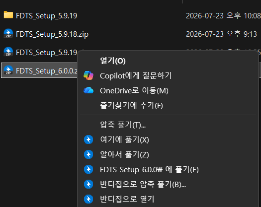
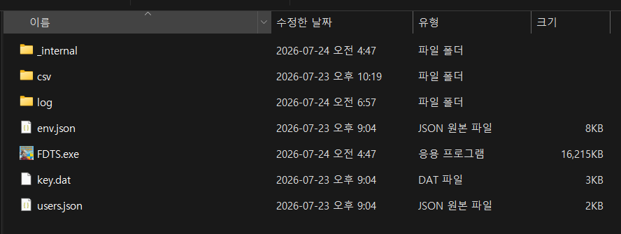

# ⬇️ 다운로드

## 설치 방법

FDTS는 별도 설치 과정이 없습니다. 압축을 풀고 실행파일을 실행하면 됩니다.

1. 배포받은 **FDTS 압축파일(zip)** 을 다운로드합니다.
2. 원하는 폴더에 **압축을 풉니다.** (예: `D:\FDTS`)
3. 폴더 안의 **`FDTS.exe`** 를 실행합니다.
4. 관리자 권한 요청(UAC) 창이 뜨면 **[예]** 를 누릅니다.

zip 파일에서 **마우스 우클릭 → [압축 풀기]** 로 풉니다.

압축을 풀면 아래처럼 파일이 나옵니다. 이 중 **`FDTS.exe`** 를 실행하세요.

!!! warning "압축은 반드시 풀어서 실행"
    zip 안에서 바로 실행하지 말고, **압축을 완전히 푼 뒤** 실행하세요. 프로그램이 옆에 있는 설정 파일들(`env.json`·`key.dat` 등)을 함께 사용합니다.

!!! note "파이썬 불필요"
    실행파일 형태라 파이썬 등 별도 설치가 필요 없습니다.

## 처음 실행 시

처음 실행하면 아래 준비 과정을 먼저 진행하세요.

1. [준비하기](prep.md) — 구글 시트 사본 + 서비스 계정 공유 + 회원가입
2. [HTS 설정](hts/meritz.md) — 메리츠 HTS·인증서 준비
3. [계정 설정](usage/accounts.md) — 매매할 계좌 등록

## 업데이트

프로그램은 최신 버전 사용을 권장합니다. **업데이트는 앱 안에서 자동으로 이루어집니다.**

- 새 버전이 있으면 실행 시 **"새 버전 안내"** 창(또는 텔레그램)이 뜹니다.
- **[예]** 를 누르면 새 코드를 자동으로 내려받아 무결성 검사 후, **"교체하고 재시작"** 확인만 누르면 앱이 스스로 종료·교체·재시작합니다.
- 이 자동 업데이트는 **코드 파일만 교체**하므로, **로그인·계좌 등 설정과 인증 정보는 그대로 유지**됩니다.

!!! warning "수동으로 교체할 때 (주의)"
    폴더를 직접 새 버전으로 바꿀 경우, **설정 파일 두 개는 반드시 남겨두세요.**

    - `env.json` (일반 설정: 시트 주소·텔레그램 등)
    - `users.json` (계정 설정: 비밀번호·계좌 순서·매매법 등)

    이 두 파일을 함께 덮어쓰면 설정이 초기화됩니다. 가능하면 위의 **앱 내 자동 업데이트**를 사용하세요(설정이 안전하게 보존됩니다).

---

문제가 있으면 [자주 묻는 질문](faq.md)을 먼저 확인해 주세요.
