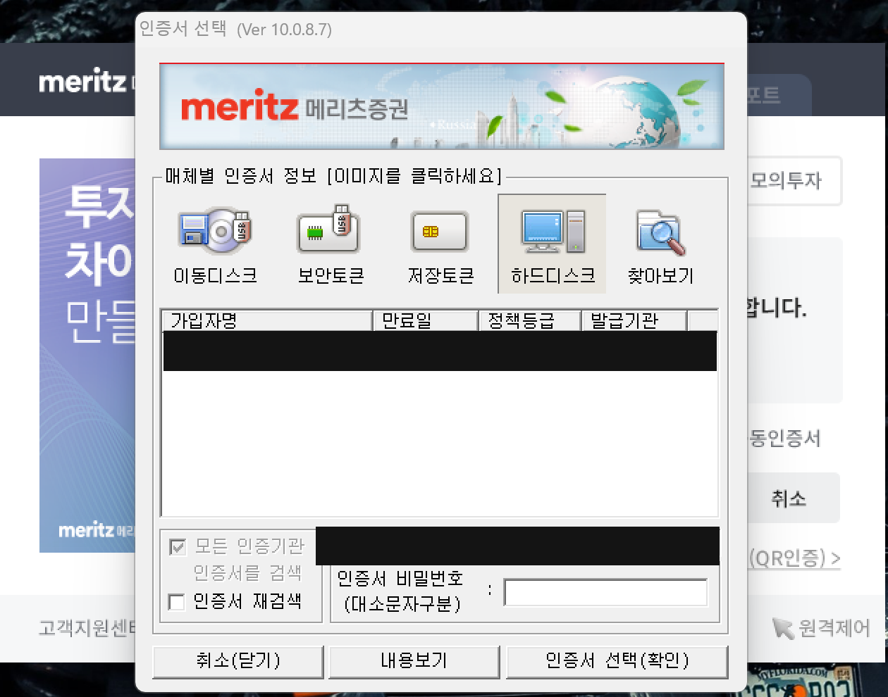
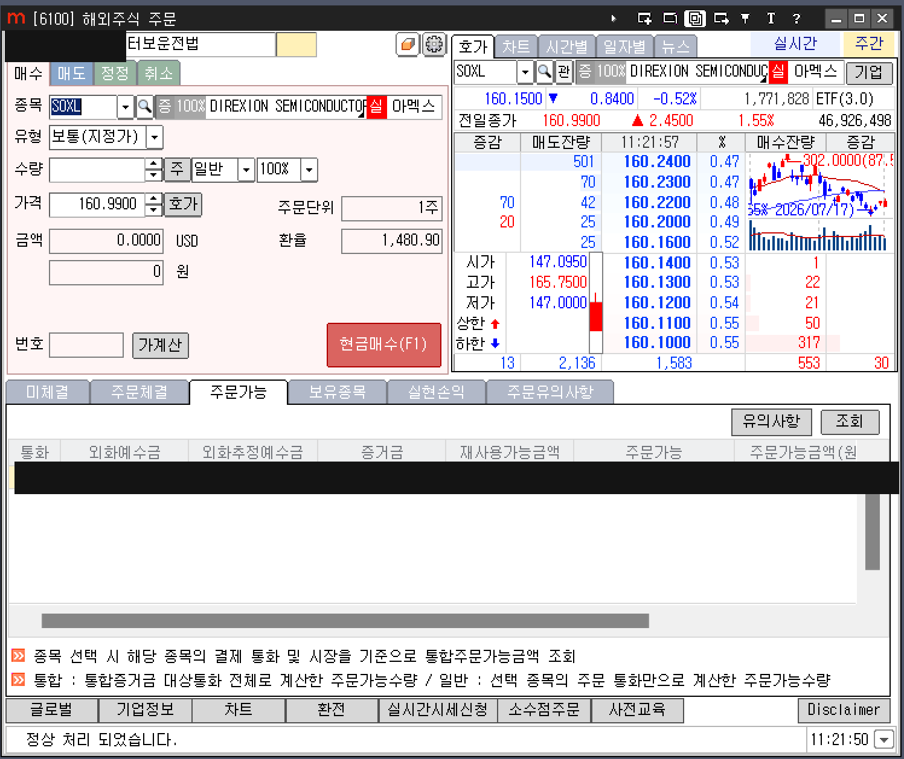

# 🇲 메리츠증권 설정

FDTS는 메리츠증권 HTS(**iMERITZ XII**)를 자동으로 조작합니다. 프로그램이 정상 동작하려면 HTS가 아래 상태로 준비되어 있어야 합니다.

## 준비 체크리스트

- [x] 메리츠증권 계좌 개설 및 **해외주식 거래 신청** 완료
- [x] HTS(iMERITZ XII) 설치
- [x] 로그인용 **공동/공인인증서** 발급 및 HTS에 등록
- [x] HTS에서 **미국 주식 주문**이 정상적으로 되는지 수동으로 한 번 확인

!!! note "표준 설치 경로"
    프로그램은 HTS 실행파일을 아래 경로에서 자동으로 찾습니다. 다른 위치에 설치했다면 **[설정] → [일반 설정] → 증권HTS 위치**에 직접 지정하세요.

    ```
    C:\메리츠증권\iMERITZ XII\Main\imeritz.exe
    ```

## 로그인 준비 (인증서)

프로그램은 실행 시 HTS 로그인 창에서 **인증서를 선택하고 비밀번호를 입력**하는 과정을 자동으로 진행합니다.

- 인증서 비밀번호는 프로그램 실행 과정에서 필요합니다. (입력 방식은 [계정 설정](../usage/accounts.md) 참고)
- 인증서가 여러 개면, 사용할 인증서가 목록에 정상적으로 보이는지 미리 확인하세요.

!!! warning "관리자 권한"
    HTS 화면을 자동으로 조작하려면 프로그램이 **관리자 권한**으로 실행되어야 합니다. FDTS.exe는 실행 시 관리자 권한을 요청합니다(UAC 창이 뜨면 '예').

## HTS 화면 설정

프로그램은 아래 HTS 화면(번호)을 사용합니다. 사용 중 자동으로 열리므로 미리 띄워둘 필요는 없습니다.

| 화면 | 용도 |
| --- | --- |
| 6002 | 해외주식 일자별 체결추이 (시세·OHLC 수집) |
| 6100 | 예수금/잔고·주문 |
| 6104 | (보조 화면) |

!!! tip "레버리지 ETP 안내창"
    SOXL 같은 레버리지 ETP는 HTS가 '사전교육' 안내창을 자동으로 띄우는 경우가 있습니다. 프로그램이 이 안내창을 자동으로 닫도록 되어 있으나, 계속 방해가 되면 HTS에서 해당 안내를 미리 확인/해제해 두면 좋습니다.

---

## 화면 예시

**인증서 선택 창** — 프로그램이 자동으로 인증서를 선택하고 비밀번호를 입력합니다.



**[6100] 해외주식 주문 화면** — 위쪽은 주문(매수/매도), 아래쪽 탭은 예수금·잔고입니다. 프로그램은 이 화면에서 잔고를 읽고 주문을 냅니다.



!!! note "화면 속 개인정보"
    위 예시 이미지는 계좌번호·잔고·이름 등 개인정보 부분을 가려 두었습니다.
