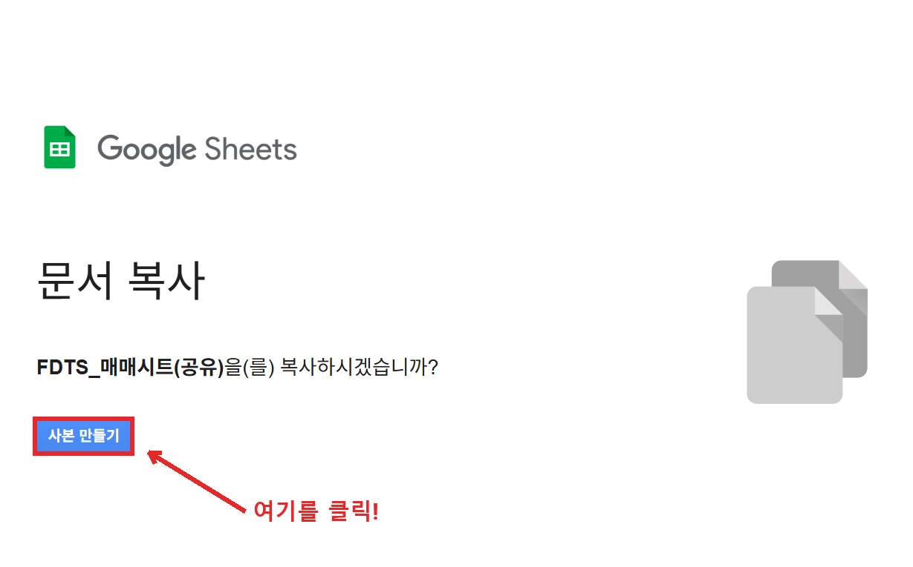
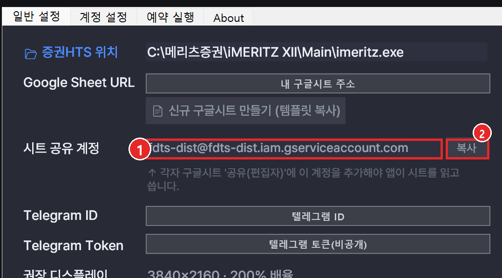

# 🗃️ 준비하기

프로그램을 실행하기 전에, **① 구글 시트 준비 → ② 서비스 계정 공유 → ③ 회원가입 → ④ 관리자 승인** 순서로 준비합니다. 한 번만 해두면 됩니다.

## 1. 구글 시트 사본 만들기

FDTS는 매매 기록과 매매법 설정을 **구글 시트**로 주고받습니다. 제공되는 템플릿 시트를 자기 구글 드라이브로 복사해서 사용합니다.

1. 프로그램을 실행하고 **[설정] → [일반 설정]** 으로 이동합니다.
2. **📄 신규 구글시트 만들기 (템플릿 복사)** 버튼을 누릅니다.
3. 브라우저에 **"사본 만들기"** 창이 바로 뜹니다. **[사본 만들기]** 를 누르면 **내 구글 드라이브에 사본이 생기고** 그 사본이 열립니다.
4. 열린 **내 시트의 주소(URL)** 를 복사해 둡니다. (아래 3번에서 입력합니다)

!!! danger "반드시 '내 사본'인지 확인하세요"
    구글 계정에 로그인돼 있어도, **사본을 만들지 않으면 그 시트는 여러 사람이 함께 보는 '원본 템플릿'** 입니다.

    원본을 그대로 쓰면 **다른 사용자와 같은 시트를 공유하게 되어, 서로의 잔고·주문 데이터가 덮어써지고 잘못된 주문이 나갈 수 있습니다.**

    - 확인하는 법: 사본은 제목이 **"… 의 사본"** 형태로 바뀌고, **내 구글 드라이브**에서 검색됩니다.

버튼을 누르면 아래처럼 **"문서 복사"** 창이 뜹니다. **[사본 만들기]** 를 누르세요.

## 2. 시트에 '서비스 계정' 공유하기

프로그램이 내 시트를 읽고 쓰려면, 시트를 **서비스 계정 이메일**에 편집자로 공유해야 합니다.

1. **[설정] → [일반 설정] → 시트 공유 계정**(①)에 표시된 이메일 주소를 확인하고 **[복사]**(②) 버튼을 누릅니다.
    - 형식: `fdts-dist@fdts-dist.iam.gserviceaccount.com`

    

2. 1번에서 만든 **내 구글 시트**를 열고 우측 상단 **[공유]** 를 누릅니다.
3. 방금 복사한 서비스 계정 이메일을 붙여넣고 **권한을 '편집자'** 로 설정한 뒤 공유합니다.

!!! note "왜 공유가 필요한가요?"
    프로그램은 로이킴에버님의 개인 구글 계정 대신 '서비스 전용 계정'으로 시트에 접근합니다. 그래서 내 시트에 그 계정을 편집자로 초대해야 프로그램이 내 시트를 읽고 쓸 수 있습니다.

## 3. 설정값 입력

**[설정] → [일반 설정]** 에서 아래를 입력하고 **[일반 설정 저장]** 을 누릅니다.

- **Google Sheet URL** — 1번에서 복사한 내 시트 주소
- **Telegram ID / Token** — 알림을 받을 텔레그램 봇 정보 (선택)
- **증권HTS 위치** — 비워두면 표준 설치 경로를 자동으로 찾습니다

자세한 항목 설명은 [설정](usage/settings.md) 문서를 참고하세요.

## 4. 회원가입 → 관리자 승인

프로그램은 **관리자 승인을 받은 회원만** 매매를 실행할 수 있습니다.

1. **[설정]** 창 하단 **회원** 영역에서 **본명·이메일**을 입력하고 **[회원가입]** 을 누릅니다.
2. "승인 대기 중" 상태가 되면, 관리자(로이킴에버)에게 승인을 요청합니다.
3. 관리자가 승인하면 **[상태 새로고침]** 을 눌러 "승인됨"으로 바뀌는지 확인합니다.

자세한 내용은 [회원(라이선스)](usage/member.md) 문서를 참고하세요.

---

준비가 끝나면 [HTS 설정](hts/meritz.md)으로 이동하세요.
