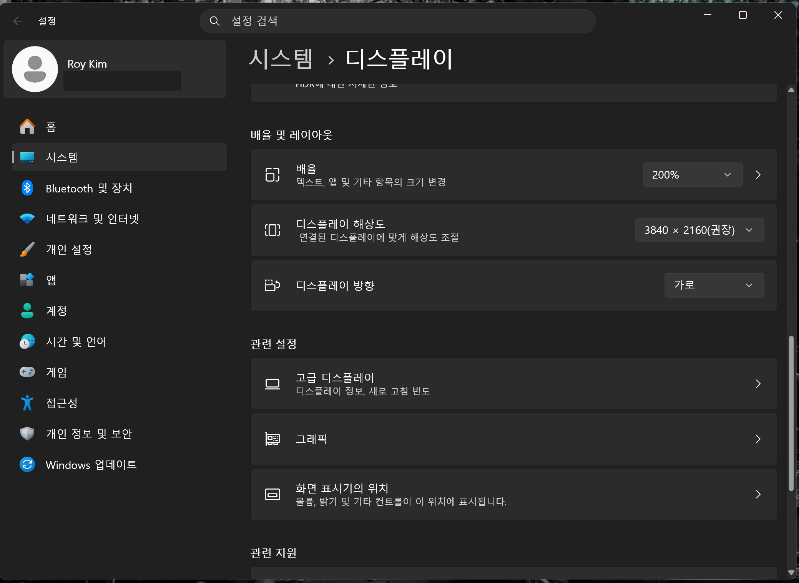

# 💻 권장사양

FDTS는 Windows PC에서 메리츠 HTS 화면을 직접 조작하는 방식이라, 아래 환경을 권장합니다.

## 운영체제 · 프로그램

| 항목 | 권장 |
| --- | --- |
| 운영체제 | Windows 10 / 11 (64bit) |
| 증권사 HTS | 메리츠증권 iMERITZ XII (설치 필요) |
| 공인/공동인증서 | 메리츠 계좌 로그인용 인증서 준비 |
| 인터넷 | 유선 권장 (자동 실행 중 끊김 방지) |

!!! note "파이썬은 필요 없습니다"
    배포본은 실행파일(FDTS.exe) 형태라, 파이썬을 따로 설치하지 않아도 됩니다. 압축을 풀고 바로 실행하시면 됩니다.

## 화면 해상도 · 배율 (중요)

FDTS는 HTS 화면의 위치를 계산해 클릭하기 때문에 **화면 해상도와 배율**의 영향을 받습니다.

!!! tip "권장 디스플레이: 3840×2160 · 200% 배율"
    제작 기준이 **3840×2160 해상도 + 200% 배율**입니다. 이 설정이 가장 안정적입니다.

최신 버전은 **다른 배율(100% · 150% 등)에서도 화면 위치를 자동으로 보정**하도록 개선되었습니다. 다만 배율이 크게 다른 환경에서는 처음 한 번 정상 동작을 눈으로 확인하시길 권합니다.

- 현재 배율은 **[설정] → [일반 설정] → 현재 디스플레이** 에서 확인할 수 있습니다.
  - "✅ 권장 설정" 이면 그대로 사용하시면 됩니다.
  - "⚠ 권장과 다름" 이면 동작은 하지만, 문제가 생기면 권장값(3840×2160 · 200%)으로 맞춰 보세요.

Windows 배율은 **[설정] → [시스템] → [디스플레이] → [배율]** 에서 바꿀 수 있습니다.

!!! warning "느린 PC라면"
    사양이 낮은 PC에서 화면 반응이 느려 오류가 나면, **[설정] → [일반 설정] → 속도 배수**를 `1.5` ~ `2.0`으로 올려 대기 시간에 여유를 주세요.

