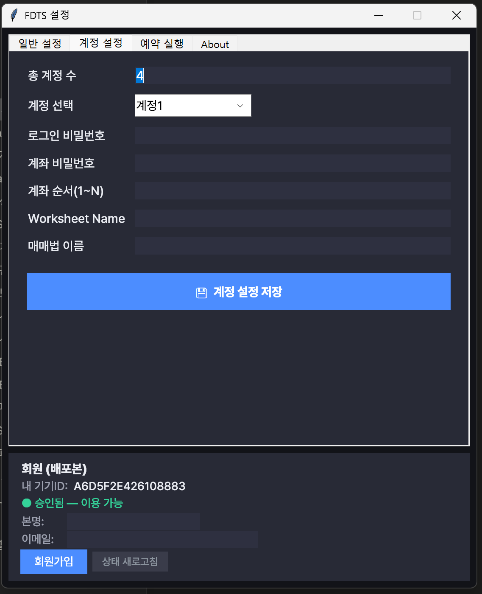
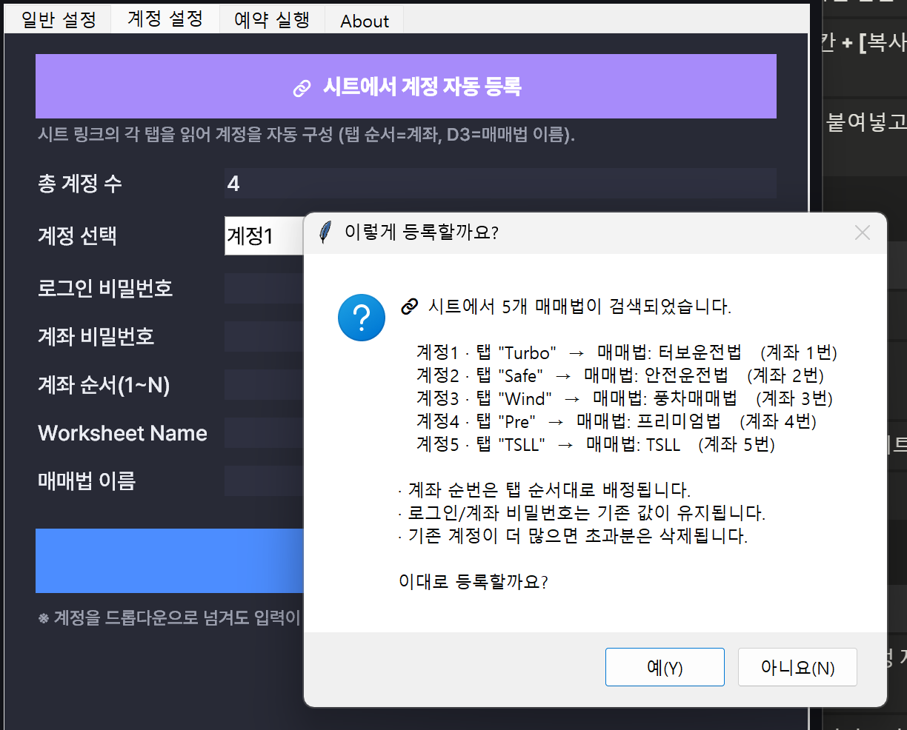

# 👤 계정 설정

여러 계좌를 매매하려면 각 계정의 로그인 정보와 매매법을 등록해야 합니다. **[설정] → [계정 설정]** 탭에서 설정합니다.

계정을 채우는 방법은 두 가지입니다.

- **🔗 시트에서 자동 등록** — 시트 링크 하나로 계정을 한 번에 구성 (**처음 세팅에 권장**)
- **✍️ 직접 입력** — 계정을 하나씩 손으로 입력



---

## 🔗 시트에서 계정 자동 등록 (권장)

**[계정 설정]** 탭 맨 위의 **[🔗 시트에서 계정 자동 등록]** 버튼을 누르면, 내 구글 시트의 **각 탭을 순서대로 읽어 계정을 자동으로 구성**합니다.



### 어떻게 동작하나

| 규칙 | 내용 |
| --- | --- |
| **계정 순서** | 시트의 **탭 순서 그대로** 계정1·계정2·계정3… 으로 배정 |
| **계좌 순서(index)** | 탭 순서대로 **1·2·3번**으로 자동 배정 |
| **매매법 이름** | 각 탭의 **D3 셀 글자**를 매매법 이름으로 사용 |
| **등록 대상** | **D3에 글자가 있는 탭만** 등록 (대시보드 등 D3가 빈 탭은 자동 제외) |
| **계정 개수** | 등록된 탭 수에 맞춰 **자동 조절** (남는 기존 계정은 삭제) |
| **비밀번호·텔레그램** | 시트에 없으므로 **기존에 입력해 둔 값을 그대로 유지** |

### 사용 순서

1. **[설정] → [일반 설정]** 에서 **Google Sheet URL** 과 **시트 공유 계정**(편집자 추가)을 먼저 마쳐 둡니다.
2. 각 매매 탭의 **D3 셀에 매매법 이름**을 적어 둡니다. (예: `Turbo` 탭 D3 = `터보운전법`)
3. **[계정 설정]** 탭 → **[🔗 시트에서 계정 자동 등록]** 클릭.
4. 아래처럼 **미리보기 확인창**이 뜹니다. 내용이 맞으면 **[등록]** 을 누릅니다.

    ```
    🔗 시트에서 4개 매매법이 검색되었습니다. 이대로 등록할까요?

       계정1 · 탭 "Turbo"  →  매매법: 터보운전법   (계좌 1번)
       계정2 · 탭 "Safe"   →  매매법: 안전운전법   (계좌 2번)
       계정3 · 탭 "Wind"   →  매매법: 풍차매매법   (계좌 3번)
       계정4 · 탭 "Pre"    →  매매법: 프리미엄법   (계좌 4번)
                                       [등록]   [취소]
    ```

5. 등록되면 변경사항 적용을 위해 프로그램이 **자동으로 종료**됩니다. 다시 실행하면 계정이 반영돼 있습니다.

!!! tip "D3가 빈 탭은 계정이 아닙니다"
    대시보드·메모처럼 매매 계정이 아닌 탭은 **D3를 비워 두면** 자동으로 제외됩니다. 반대로 매매 탭은 반드시 D3에 매매법 이름을 넣어야 등록됩니다.

!!! warning "계좌 순서(index)는 반드시 확인하세요"
    자동 등록은 계좌 순서를 **탭 순서대로 1·2·3** 으로 배정합니다. 내 HTS 계좌 목록의 실제 순서와 다르면, 등록 후 **[✍️ 직접 입력]** 에서 계좌 순서만 바로잡아 주세요. (아래 <b>계좌 순서</b> 경고 참고)

---

## ✍️ 직접 입력

계정을 하나씩 손으로 설정하거나, 자동 등록 후 일부만 고칠 때 사용합니다.

| 항목 | 설명 |
| --- | --- |
| **계정 선택** | 설정할 계정을 고릅니다 (계정1, 계정2, …). |
| **로그인 비밀번호** | HTS 로그인(공동/공인인증서) 비밀번호 |
| **계좌 비밀번호** | 계좌 거래 비밀번호 (HTS의 9507 화면 등에서 사용) |
| **계좌 순서(1~N)** | HTS 계좌 목록에서 이 계정이 몇 번째인지 (아주 중요, 아래 참고) |
| **Worksheet Name** | 이 계정이 사용할 구글 시트의 **탭(워크시트) 이름** (예: `Turbo`, `Safe`) |
| **매매법 이름** | 표시용 매매법 이름 (예: 터보운전법, 안전운전법) |

설정 후 **[💾 계정 설정 저장]** 을 누릅니다. 계정마다 반복합니다.

!!! danger "계좌 순서(index)를 정확히 맞추세요"
    프로그램은 HTS 계좌 드롭다운에서 **'계좌 순서' 번째 계좌를 선택**해 매매합니다. 이 번호가 틀리면 **다른 계좌에 주문이 나갈 수 있습니다.** HTS 계좌 목록에서 실제 순서를 확인하고 정확히 입력하세요.

!!! warning "비밀번호 보관"
    로그인/계좌 비밀번호는 이 PC의 설정 파일에 저장됩니다. 공용 PC에서는 사용을 피하세요.

## 계정 개수

**계정 설정** 탭에서 사용할 **계정 개수**를 지정할 수 있습니다(기본 4, 최대 20). 실제로 매매할 계좌 수에 맞춰 설정하세요. (자동 등록을 쓰면 이 값도 **탭 수에 맞춰 자동으로 맞춰집니다.**)

## 매매법과 시트의 관계

계정마다 **서로 다른 매매법(시트 탭)** 을 연결할 수 있습니다. 예를 들어:

| 계정 | 매매법 이름 | Worksheet Name |
| --- | --- | --- |
| 계정1 | 터보운전법 | Turbo |
| 계정2 | 안전운전법 | Safe |
| 계정3 | 풍차매매법 | Wind |
| 계정4 | 프리미엄법 | Pre |
| 계정5 | 용돈법 | TSLL |

각 시트 탭이 곧 하나의 매매법입니다. 시트 구조와 매매법 설정은 [시트매매(매매법)](sheet.md) 문서를 참고하세요.

!!! note
    위 표는 예시입니다. 실제 매매법 이름·시트 탭 이름은 사용 중인 템플릿 시트에 맞춰 입력하세요.

---

다음: [예약 실행](schedule.md)에서 정해진 시각에 자동 실행하는 방법을 안내합니다.
