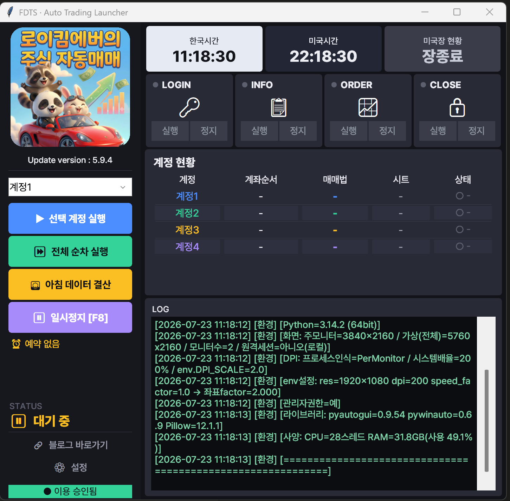

# ⭐ 공통 (기본 화면과 실행 흐름)

프로그램을 실행하면 아래와 같은 메인 화면이 나옵니다. 실행 방법을 이해하려면 먼저 화면 구성을 아는 것이 좋습니다.

## 화면 구성

### 상단 시계
- **한국시간 / 미국시간 / 미국장 현황** — 현재 시각과 미국장 상태(장전·장중·장종료)를 표시합니다.

### 실행 단계 (LOGIN · INFO · ORDER · CLOSE)
자동매매는 아래 4단계로 진행됩니다. 각 단계에는 **실행 / 정지** 버튼이 있습니다.

| 단계 | 하는 일 |
| --- | --- |
| **LOGIN** | HTS 실행 + 인증서 로그인 |
| **INFO** | 예수금·잔고·시세(OHLC) 수집 → 구글 시트 갱신 |
| **ORDER** | 매매법(시트)에 따라 주문 |
| **CLOSE** | HTS 종료 |

!!! note
    보통은 단계별 버튼을 따로 누르지 않고, 아래의 **선택 계정 실행 / 전체 순차 실행 / 아침 데이터 결산** 버튼으로 한 번에 진행합니다.

### 주요 실행 버튼
- **▶ 선택 계정 실행** — 위 드롭다운에서 고른 **한 계정만** 실행합니다.
- **⏩ 전체 순차 실행** — 등록된 **모든 계정을 순서대로** 실행합니다.
- **☀️ 아침 데이터 결산** — 주문 없이 **잔고·시세만 수집**해 시트에 기록합니다. ([자세히](morning.md))
- **⏸ 일시정지 [F8]** — 실행 중인 작업을 즉시 멈춥니다. 다시 누르면 그 지점부터 재개합니다.

### 계정 현황 표
현재 등록된 계정과 각 계정의 **계좌순서 · 매매법 · 시트 · 상태**를 한눈에 보여줍니다. ([계정 설정](accounts.md))

### 로그(LOG)
실행 중 진행 상황이 실시간으로 기록됩니다. 문제가 생기면 이 로그를 먼저 확인하세요. (로그 파일은 이벤트별로 저장됩니다.)

## 기본 실행 흐름

가장 많이 쓰는 순서는 다음과 같습니다.

1. 프로그램 실행 (관리자 권한 UAC → '예')
2. 매매할 계정을 확인 (계정 현황 표)
3. **▶ 선택 계정 실행** 또는 **⏩ 전체 순차 실행** 클릭
4. 로그와 STATUS로 진행 상황 확인
5. 완료되면 자동으로 HTS 종료

!!! tip "일시정지 활용"
    실행 중 이상하다 싶으면 즉시 **F8(일시정지)** 를 눌러 멈추세요. 마우스가 자동으로 움직이는 중에는 PC를 건드리지 않는 것이 좋습니다.

---

다음: [설정](settings.md) — 일반 설정부터 계정·예약·업데이트까지 안내합니다.
