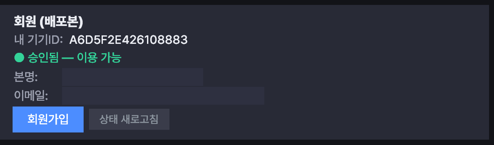

# 👥 회원 (라이선스)

FDTS는 **관리자 승인을 받은 회원만** 매매를 실행할 수 있습니다. 처음 사용할 때 한 번 가입하고 승인을 받으면 됩니다.

## 회원가입

1. **[설정]** 창을 열고 하단의 **회원** 영역으로 이동합니다.
2. **본명**과 **이메일**을 입력합니다.
3. **[회원가입]** 버튼을 누릅니다.
4. 상태가 **"승인 대기 중"** 으로 바뀝니다.

!!! note "내 기기ID"
    회원 영역에는 이 PC의 **기기ID**가 함께 표시됩니다. 가입은 이 기기 기준으로 등록되며, 관리자가 승인할 때 참고합니다.

## 승인 받기

- 가입하면 관리자(로이킴에버)에게 **승인 요청**이 전달됩니다.
- 관리자가 승인하면, **[상태 새로고침]** 버튼을 눌러 상태가 **"승인됨"** 으로 바뀌는지 확인합니다.
- 승인 전에는 매매 실행이 제한됩니다.

## 상태 표시

| 상태 | 의미 |
| --- | --- |
| 미가입 | 아직 회원가입을 하지 않음 → 가입 필요 |
| 승인 대기 중 | 가입 완료, 관리자 승인 대기 |
| 승인됨 | 정상 이용 가능 |

!!! tip "인터넷이 잠깐 끊겨도"
    승인 확인 중 인터넷이 잠깐 끊겨도, 최근에 승인받은 이력이 있으면 잠시 동안은 정상적으로 실행됩니다. 오래 끊기면 실행이 제한될 수 있으니 네트워크를 확인하세요.

---

다음: [설정](settings.md)
