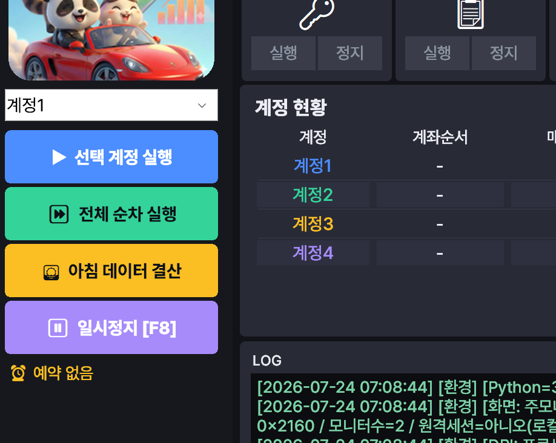

# ☀️ 아침 데이터 결산

**아침 데이터 결산**은 주문 없이 **잔고·시세만 수집**해 구글 시트를 갱신하는 기능입니다. 매일 아침(미국장 마감 후) 실행해 계좌 현황과 성과를 최신 상태로 유지할 때 사용합니다.

## 일반 실행과의 차이

| 구분 | 하는 일 | 주문 |
| --- | --- | --- |
| 선택/전체 실행 | 잔고·시세 수집 **+ 주문** | ✅ 낸다 |
| **아침 데이터 결산** | 잔고·시세 수집만 | ❌ 안 낸다 (데이터 동기화 모드) |

!!! note "안전한 데이터 확인용"
    아침 결산은 주문을 내지 않으므로, 계좌를 건드릴 걱정 없이 **현재 잔고·시세를 시트에 반영**하는 용도로 안전하게 쓸 수 있습니다.

## 실행 방법

- 메인 화면의 **☀️ 아침 데이터 결산** 버튼을 누르면 모든 계정을 순서대로 돌며 데이터를 수집합니다.

    

- 또는 [예약 실행](schedule.md)에서 **아침결산**을 예약해 매일 자동으로 돌릴 수 있습니다. (자동 예약 기본값: 정규장 종료 + 10분)

## 진행 과정 (로그 예시)

```
[계정1] 정보 수집 시작
[계정1] 예수금/잔고 데이터 추출 완료
[계정1] 티커: SOXL
[계정1] OHLC 데이터 추출 완료
[계정1] 구글 시트 갱신 완료
[계정1] 주문 스킵 (데이터 동기화 모드)
[계정1] 주문 프로세스 완료
```

각 계정마다 위 과정을 반복하고, 끝나면 HTS를 종료합니다.

!!! tip "계정별 값이 서로 다른지 확인"
    결산 후 시트에서 **각 계정의 잔고·보유량이 서로 다르게** 들어왔는지 한 번 확인하세요. 만약 모든 계정이 똑같은 값이면 계좌 전환이 제대로 안 된 것일 수 있으니, [계정 설정](accounts.md)의 **계좌 순서**를 점검하세요.

---

다음: [회원(라이선스)](member.md)
