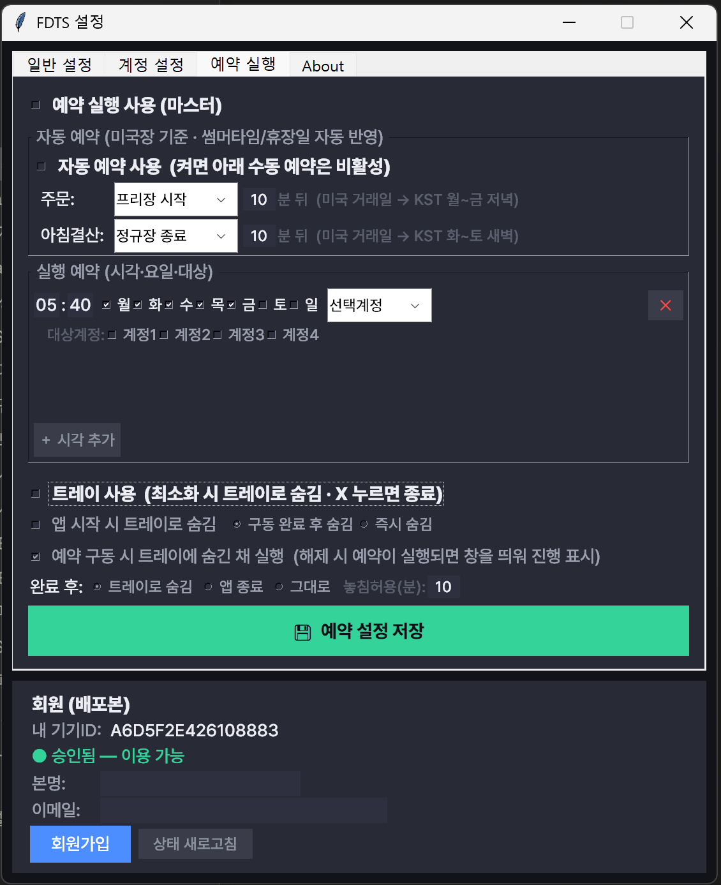

# ⏰ 예약 실행

정해진 시각에 프로그램이 **자동으로 실행**되도록 예약할 수 있습니다. **[설정] → [예약 실행]** 탭에서 설정합니다.

## 마스터 스위치

맨 위 **예약 실행 사용 (마스터)** 를 켜야 예약이 동작합니다. 꺼두면 아래 설정과 상관없이 예약이 실행되지 않습니다.

## 자동 예약 (권장)

**미국장 시각을 기준**으로 자동으로 예약을 잡아 줍니다. **썸머타임과 미국 휴장일이 자동 반영**되므로 가장 편리합니다.

- **자동 예약 사용** 을 켜면, 아래 **수동 예약은 비활성화**됩니다.
- 기준(앵커)은 세 가지 중에서 고릅니다: **프리장 시작 · 정규장 시작 · 정규장 종료**
- 각 작업을 "앵커 + N분 뒤"로 설정합니다.

| 작업 | 기본 설정 | 실행 시점(예시) |
| --- | --- | --- |
| **주문** | 프리장 시작 + 10분 | 미국 거래일 기준 → 한국시간 월~금 저녁 |
| **아침결산** | 정규장 종료 + 10분 | 미국 거래일 기준 → 한국시간 화~토 새벽 |

!!! tip
    미국장은 한국과 시차가 있고 썸머타임에 따라 시각이 바뀝니다. 자동 예약을 쓰면 이 계산을 프로그램이 알아서 하므로, 직접 시각을 관리하지 않아도 됩니다.

## 수동 예약

원하는 **시각·요일·대상**을 직접 지정하는 방식입니다. (자동 예약을 끄면 사용 가능)

- **시각** — 실행할 시각 (예: `05:40`)
- **요일** — 실행할 요일 (월~일 중 선택)
- **대상** — 무엇을 실행할지
    - **선택계정** — 드롭다운에서 고른 한 계정
    - **전체** — 모든 계정 순차 실행
    - **아침결산** — 잔고·시세만 수집 ([자세히](morning.md))

여러 개의 예약을 추가할 수 있습니다. 설정 후 저장하세요.

!!! warning "PC가 켜져 있어야 합니다"
    예약 실행은 PC가 **켜져 있고 프로그램이 실행(또는 트레이 상주)** 중일 때만 동작합니다. 절전/최대절전 모드로 들어가지 않도록 전원 설정을 확인하세요.

---

다음: [아침 데이터 결산](morning.md)
