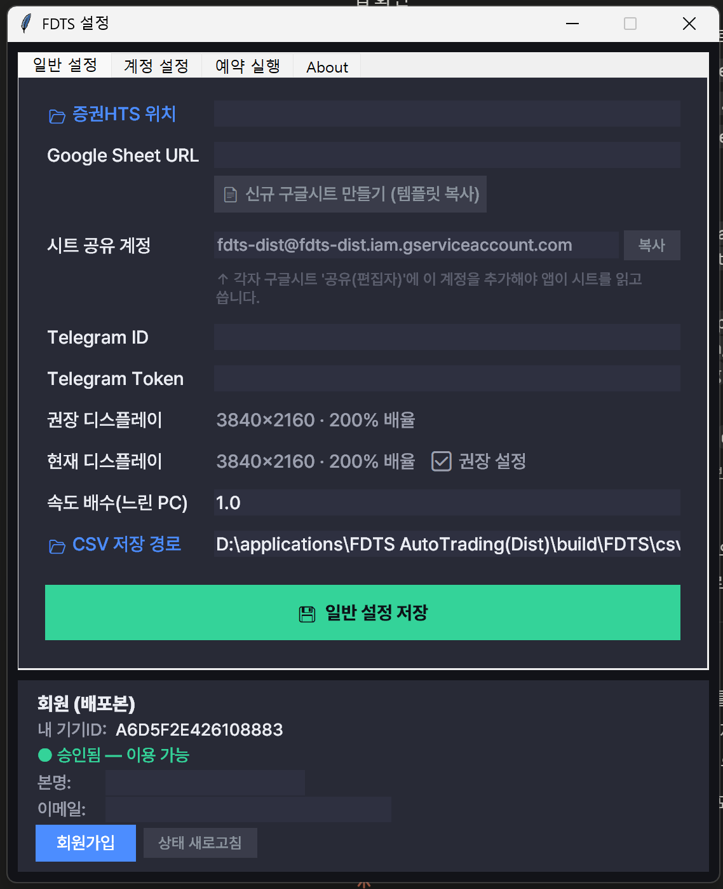

# ⚙️ 설정

메인 화면 하단의 **⚙️ 설정** 을 누르면 설정 창이 열립니다. 설정 창은 **일반 설정 · 계정 설정 · 예약 실행 · About** 네 개의 탭으로 구성됩니다.

이 문서는 **일반 설정** 탭을 안내합니다. (계정 설정은 [계정 설정](accounts.md), 예약 실행은 [예약 실행](schedule.md) 참고)

## 일반 설정 항목

| 항목 | 설명 |
| --- | --- |
| **📂 증권HTS 위치** | 메리츠 HTS 실행파일 경로. 비워두면 표준 경로를 자동 탐색합니다. |
| **Google Sheet URL** | 매매에 사용할 내 구글 시트 주소 |
| **📄 신규 구글시트 만들기 (템플릿 복사)** | 누르면 템플릿 시트가 브라우저에 열립니다. '사본 만들기'로 복사해 쓰세요. |
| **시트 공유 계정** | 내 시트에 편집자로 공유해야 할 서비스 계정 이메일. **[복사]** 로 복사합니다. |
| **Telegram ID / Token** | 실행 결과·오류 알림을 받을 텔레그램 봇 정보 (선택) |
| **권장 디스플레이 / 현재 디스플레이** | 권장 화면 설정과 지금 내 화면 상태를 표시 (아래 참고) |
| **속도 배수(느린 PC)** | 대기 시간 배수. 느린 PC에서 오류가 나면 1.5~2.0으로 올리세요. |
| **📂 CSV 저장 경로** | 수집 데이터를 임시 저장할 폴더 |

설정을 바꾼 뒤 **[💾 일반 설정 저장]** 을 누릅니다.

!!! note "저장 후 재시작"
    일반 설정을 저장하면 변경사항 적용을 위해 프로그램이 종료됩니다. 다시 실행해 주세요.

## 디스플레이 안내

- **권장 디스플레이**: `3840×2160 · 200% 배율`
- **현재 디스플레이**: 지금 내 화면의 해상도·배율을 자동으로 감지해 보여줍니다.
    - **✅ 권장 설정** — 그대로 사용
    - **⚠ 권장과 다름** — 동작은 하지만, 문제가 생기면 권장값으로 맞춰 보세요

!!! tip
    배율은 사용자가 직접 지정하지 않아도 프로그램이 **현재 화면 배율을 자동 감지**해 클릭 위치를 보정합니다. 자세한 내용은 [권장사양](../requirements.md)을 참고하세요.

## 시트 공유 계정 (중요)

프로그램이 내 시트를 읽고 쓰려면, **시트 공유 계정** 이메일을 내 구글 시트의 공유(편집자)에 추가해야 합니다.

1. **[복사]** 버튼으로 이메일 주소를 복사합니다.
2. 내 구글 시트 → **[공유]** → 붙여넣기 → 권한 **'편집자'** → 공유.

자세한 절차는 [준비하기](../prep.md)를 참고하세요.

## 업데이트 (새 버전 설치)

프로그램은 **앱 안에서 자동으로** 업데이트됩니다. 새 버전이 나오면 아래 방법으로 설치하세요.

### 사이드바의 버전 버튼

메인 화면 **사이드바 하단(설정 위)**에 현재 버전이 표시됩니다.

| 표시 | 뜻 | 할 일 |
| --- | --- | --- |
| **v5.9.11 최신** | 최신 버전 사용 중 | 할 것 없음 |
| **v5.9.15 업데이트** (강조색) | 새 버전 있음 | **이 버튼을 클릭** → 업데이트 진행 |

### 상황별 — 이럴 때 이렇게 하세요

- **텔레그램으로 "새 버전" 알림을 받았을 때**
    → 앱을 열고, 사이드바의 **버전 버튼(“…업데이트”)을 클릭**하면 바로 업데이트가 시작됩니다.
- **앱을 새로 시작했을 때 / 실행 버튼을 눌렀을 때**
    → 새 버전이 있으면 **"새 버전 안내" 팝업**이 뜹니다. **[예]** 를 누르세요.
- **자동 실행(예약 매매) 중일 때**
    → 매매를 멈추지 않도록 **텔레그램으로만** 알려줍니다. 매매가 끝난 뒤 위 방법으로 업데이트하세요.

### 업데이트가 진행되는 과정

1. **[예]** 또는 **버전 버튼 클릭** → 새 코드를 자동으로 내려받아 **무결성 검사**
2. **"교체하고 재시작"** 확인 창 → **[예]**
3. 앱이 **스스로 종료 → 코드만 교체 → 재시작**

!!! tip "설정은 그대로 유지됩니다"
    자동 업데이트는 **프로그램 코드만** 바꿉니다. 로그인·계좌·시트 주소 등 **설정과 인증 정보는 절대 지워지지 않습니다.**

!!! warning "매매 중에는 업데이트되지 않습니다"
    매매가 실행 중일 때 업데이트를 누르면 안전하게 거부됩니다. 실행이 끝난 뒤 다시 시도하세요.

---

다음: [다운로드](../download.md)
