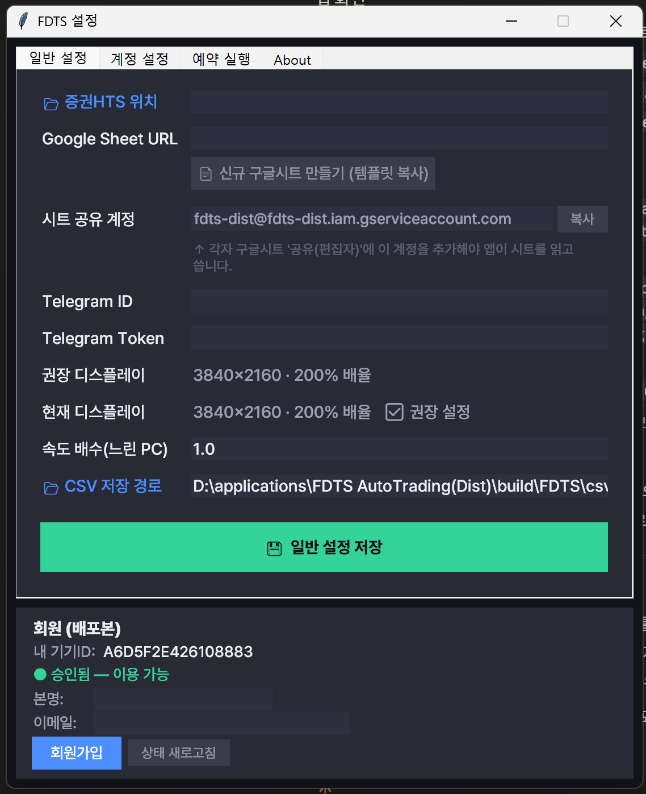

# 🔧 일반 설정

메인 화면 사이드바의 **⚙️ 설정** 을 누르면 설정 창이 열립니다. 설정 창은 **일반 설정 · 계정 설정 · 예약 실행 · About** 네 개의 탭으로 구성됩니다.

이 문서는 첫 번째 **일반 설정** 탭을 안내합니다.
계정은 [계정 설정](accounts.md), 예약은 [예약 실행](schedule.md), 새 버전 설치는 [업데이트](update.md)를 참고하세요.

## 한눈에 보기

| 항목 | 무엇을 넣나 | 참고 |
| --- | --- | --- |
| 📂 증권HTS 위치 | 메리츠 HTS 실행파일 경로 | **라벨 클릭 → 파일 선택** |
| Google Sheet URL | 매매에 쓸 내 구글 시트 주소 | **칸 더블클릭 → 시트 열기** |
| 📄 신규 구글시트 만들기 | 템플릿 시트 열기(사본 만들기) | 처음 한 번 |
| 시트 공유 계정 | 내 시트에 편집자로 추가할 이메일 | **[복사]** 버튼 |
| Telegram ID / Token | 알림 받을 봇 정보 (선택) | |
| 권장 / 현재 디스플레이 | 화면 설정 상태 표시 | 자동 감지 |
| 속도 배수(느린 PC) | 대기 시간 배수 | 느리면 1.5~2.0 |
| 📂 CSV 저장 경로 | 수집 데이터 임시 저장 폴더 | **라벨 클릭 → 폴더 선택** |

설정을 바꾼 뒤 맨 아래 **[💾 일반 설정 저장]** 을 누릅니다.

---

## 항목별 상세

### 📂 증권HTS 위치
메리츠 HTS(iMERITZ XII)의 실행파일(`imeritz.exe`) 경로입니다.

- **비워두면** 프로그램이 표준 설치 위치(C·D·E·F 드라이브의 `메리츠증권\iMERITZ XII\Main\imeritz.exe`)를 **자동으로 찾습니다.** 보통은 그대로 두어도 됩니다.
- 직접 지정하려면 **"📂 증권HTS 위치" 라벨(파란 글자)을 클릭**하면 파일 선택 창이 열립니다.

### Google Sheet URL
매매에 사용할 **내 구글 시트 주소**입니다. 전체 URL(`https://docs.google.com/…`) 또는 시트 키(URL 가운데의 긴 문자열)를 넣을 수 있습니다.

!!! tip "칸을 더블클릭하면 시트가 열립니다"
    입력칸을 **더블클릭**하면 그 시트가 브라우저로 바로 열려, 주소가 맞는지 확인할 수 있습니다.

### 📄 신규 구글시트 만들기 (템플릿 복사)
매매법 시트가 아직 없다면 이 버튼을 누르세요. **템플릿 시트**가 브라우저에 열립니다. 구글에서 **파일 → 사본 만들기**로 내 계정에 복사한 뒤, 그 사본의 주소를 위 **Google Sheet URL** 에 넣습니다.

### 시트 공유 계정 (중요)
프로그램이 내 시트를 **읽고 쓰려면**, 여기 표시된 **서비스 계정 이메일**을 내 구글 시트의 공유(편집자)에 추가해야 합니다.

1. 옆의 **[복사]** 버튼으로 이메일 주소를 복사합니다.
2. 내 구글 시트 → **[공유]** → 붙여넣기 → 권한 **'편집자'** → 공유.

!!! danger "이 절차를 빠뜨리면 매매가 안 됩니다"
    시트 공유 계정을 편집자로 추가하지 않으면, 앱이 시트를 읽지 못해 **잔고·시세 수집과 주문이 모두 실패**합니다. 자세한 절차는 [준비하기](../prep.md)를 참고하세요.

### Telegram ID / Token (선택)
실행 결과·오류·새 버전 알림을 **텔레그램**으로 받고 싶을 때 봇 정보를 넣습니다. 비워두면 알림만 오지 않을 뿐, 매매는 정상 동작합니다.

### 권장 / 현재 디스플레이
- **권장 디스플레이**: `3840×2160 · 200% 배율`
- **현재 디스플레이**: 지금 내 화면의 해상도·배율을 **자동 감지**해 보여줍니다.
    - **✅ 권장 설정** — 그대로 사용하세요.
    - **⚠ 권장과 다름** — 동작은 하지만, 좌표가 어긋나 문제가 생기면 권장값으로 맞춰 보세요.

!!! tip "배율은 자동으로 맞춥니다"
    배율(100%·150%·200%)은 직접 고르지 않아도 프로그램이 **현재 화면 배율을 자동 감지**해 클릭 위치를 보정합니다. 자세한 내용은 [권장사양](../requirements.md)을 참고하세요.

### 속도 배수(느린 PC)
모든 대기·타임아웃 시간에 곱해지는 **여유 배수**입니다(기본 `1.0`).

- 느린 PC에서 "창을 못 찾음 / 시간초과" 오류가 나면 **`1.5`~`2.0`** 으로 올려 보세요.
- 안전 범위는 `0.5`~`5.0` 입니다.

### 📂 CSV 저장 경로
잔고·시세를 수집할 때 만드는 **임시 CSV 파일**을 저장할 폴더입니다. 보통 기본값(`csv`)이면 충분하고, **라벨을 클릭**하면 폴더를 바꿀 수 있습니다.

---

## 저장

설정을 바꾼 뒤 **[💾 일반 설정 저장]** 을 누릅니다.

!!! note "저장 후 재시작"
    일반 설정을 저장하면 변경사항 적용을 위해 프로그램이 **자동으로 종료**됩니다. 다시 실행해 주세요.

## ☁️ 설정 백업 · 복원 (구글시트)

일반 설정 저장 버튼 아래에 **[☁️ 시트에 백업]** 과 **[⬇️ 시트에서 복원]** 이 있습니다. 별도 프로그램 없이 **내 구글시트**에 설정을 통째로 저장·복원합니다.

| 버튼 | 하는 일 |
| --- | --- |
| **☁️ 시트에 백업** | 현재 모든 설정(계정·비밀번호 포함)을 **내 시트 가장 오른쪽 `_FDTS_백업` 탭**에 저장 |
| **⬇️ 시트에서 복원** | 그 백업으로 현재 설정을 **덮어써 되돌림** (확인 후 재시작) |

!!! tip "언제 쓰나요?"
    - **PC를 바꿀 때** — 새 PC에서 시트만 연결하고 **[복원]** 하면 계정·비번까지 그대로 옮겨집니다.
    - **설정이 꼬였을 때** — 마지막으로 백업한 상태로 되돌립니다.

!!! note "비밀번호는 암호화됩니다"
    로그인·계좌 비밀번호와 텔레그램 토큰은 **암호화되어 저장**되어, 시트를 열어봐도 보이지 않습니다. 복원할 때 프로그램이 자동으로 풀어 주므로 사용에는 아무 차이가 없습니다. (`_FDTS_백업` 탭은 앱이 자동으로 만들며, **직접 수정하지 마세요.**)

---

다음: [계정 설정](accounts.md)에서 매매할 계좌를 등록하는 방법을 안내합니다.
