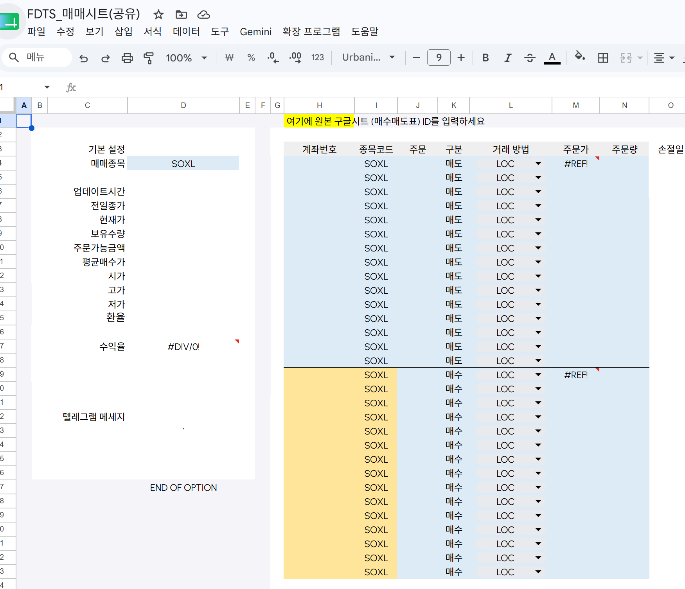

# 📊 시트매매 (매매법)

FDTS는 **구글 시트**를 통해 매매합니다. 시트의 각 **탭(워크시트)** 이 하나의 매매법이며, 계정마다 원하는 탭을 연결해 서로 다른 전략으로 운용합니다.

## 동작 방식

1. 프로그램이 실행되면 각 계정에 연결된 **시트 탭을 읽어** 그날의 주문 조건을 확인합니다.
2. HTS에서 **잔고·시세(OHLC)** 를 수집해 시트에 기록합니다.
3. 시트의 **매수매도표**에 따라 **주문**을 냅니다. (SOXL **LOC** 주문)
4. 주문 결과와 잔고를 다시 시트에 반영합니다.

!!! note "왜 시트로 매매하나요?"
    매매법마다 조건이 다양하기 때문에, 프로그램을 고치지 않고 **시트만 바꿔서** 여러 매매법을 운용할 수 있도록 설계되었습니다.

## 매매법 시트 구성

각 매매법 시트는 크게 **① 기본 설정 블록** 과 **② 매수매도표** 로 이루어져 있습니다.

### ① 기본 설정 블록 (왼쪽)

| 항목 | 설명 |
| --- | --- |
| **매매종목** | 매매할 종목 (예: SOXL) |
| 업데이트시간 · 전일종가 · 현재가 | 프로그램이 수집해 자동으로 채웁니다 |
| 보유수량 · 주문가능금액 · 평균매수가 | 계좌 잔고에서 자동으로 채웁니다 |
| 시가 · 고가 · 저가 · 환율 | 시세에서 자동으로 채웁니다 |
| 수익율 | 위 값들로 자동 계산됩니다 |

사용자는 보통 **매매종목** 정도만 확인하면 되고, 나머지는 실행할 때마다 프로그램이 갱신합니다.

### ② 매수매도표 (오른쪽)

실제 주문 조건이 담기는 표입니다.

| 열 | 설명 |
| --- | --- |
| **계좌번호** | 주문 대상 계좌 |
| **종목코드** | 종목 (예: SOXL) |
| **주문 / 구분** | 매도 / 매수 구분 |
| **거래 방법** | 주문 방식 — **LOC**(종가 지정가, Limit On Close) |
| **주문가** | 주문 가격 (수식으로 계산되는 경우가 많음) |
| **주문량** | 주문 수량 |
| **손절** | 손절 조건 |

- 표는 위쪽 **매도 구간**과 아래쪽 **매수 구간**으로 나뉩니다.
- 맨 위의 안내(노란색)처럼, **원본 매수매도표 시트의 ID**를 입력해 원본 표를 불러오는 방식도 지원합니다.

!!! tip "LOC 주문이란?"
    **LOC(Limit On Close)** 는 '종가 기준 지정가' 주문입니다. 장 마감 시점의 종가가 지정한 조건을 만족하면 체결됩니다. 매매법은 이 LOC 주문을 활용해 설계되어 있습니다.

!!! warning "표 수정은 신중히"
    매수매도표의 수식·구조는 매매 결과에 직접 영향을 줍니다. 구조를 잘 모른다면 **매매종목·기본값 정도만** 조정하고, 표 자체는 템플릿 그대로 두는 것을 권합니다.

---

다음: [예약 실행](schedule.md)
